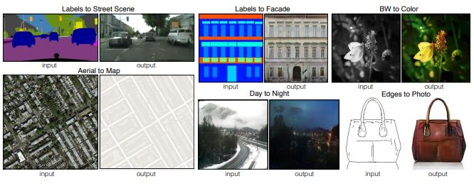
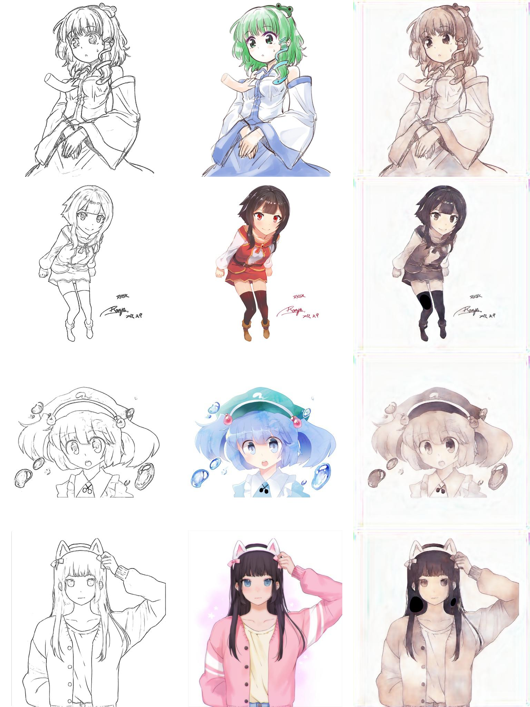

# pix2pix_for_sket2chracter

This repository implements the paper ["Image-to-Image Translation with Conditional Adversarial Networks"](https://arxiv.org/pdf/1611.07004.pdf) published in CVPR2017.

## Requirements
* python3.6+
* pytorch 1.6.0
* others.

## Usage
training a model
```bash
python3 main.py --config config.yml
```

testing a model
```bash
Not implmented yet
```

## Architecture

## Results


## Comment
The image size is 512 and color is various on character shape. The model can not restore colorful image but minor hyper-parameter tuning and model architecturing make task perfect.   

## Reference
1. spectral normalization : https://github.com/christiancosgrove/pytorch-spectral-normalization-gan/blob/master/spectral_normalization.py
2. unet : https://github.com/milesial/Pytorch-UNet
3. dataset : https://www.kaggle.com/ktaebum/anime-sketch-colorization-pair
